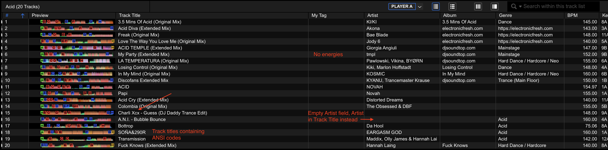
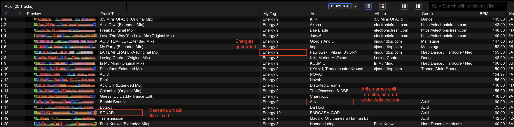
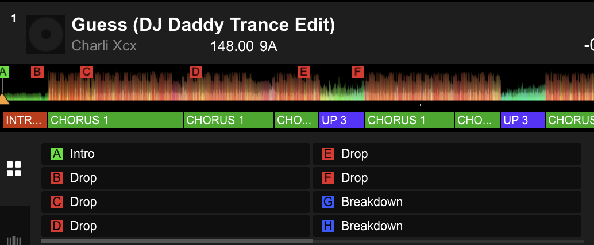

# DJ Agent

An AI agent that enriches your Rekordbox library — energy ratings, cue points, metadata cleanup, duplicate detection — powered by [Claude Code](https://docs.claude.com/en/docs/claude-code/overview).

No app to install. Just talk to the agent and it operates directly on your Rekordbox DB and XML.

> **Fork-friendly, contribution-closed.** You're welcome to fork this repo and make it your own. PRs will not be reviewed or merged — this is a personal tool shared publicly for other DJs to use and adapt.

---

## What it does

| Feature | Detail |
|---|---|
| **Energy ratings** | Analyses audio (RMS loudness, spectral brightness, onset density, bass energy) and assigns a 1–10 energy rating, written to Rekordbox's My Tag system |
| **Hot cue detection** | Detects intros, drops, breakdowns, and outros via structural analysis — written as colour-coded hot cues (A–H) |
| **Metadata cleanup** | Fixes artist/title splits, strips ANSI/HTML artifacts, normalises casing and garbage characters |
| **Duplicate detection** | Finds dupes via file hashing, audio fingerprinting, and fuzzy artist+title matching |
| **Broken track relocation** | Finds missing/moved files and offers to relocate them |
| **Library health report** | Summary of quality issues, missing metadata, and suspicious BPM values |

**What this agent doesn't do:** BPM detection, key detection, beat grid analysis, or waveform generation. Rekordbox is the source of truth for all of these. Import your tracks into Rekordbox first, let it do the audio analysis, then run this agent to pick up where Rekordbox leaves off.

---

## Demo

Running `magic` on the Acid playlist (20 tracks):

### Before
No energy tags. Several tracks have artist names stuck in the title field, and some titles contain ANSI/HTML entity artifacts (`SOÑA&290R`, `&amp;`).



### After
Energy ratings (7–10) written to My Tag. Artist names extracted from titles into the Artist column. Garbled title characters fixed.



### Hot cue detection
Structural analysis detects intros, drops, breakdowns, and outros — written as colour-coded hot cues (A–H).



---

## Getting started

### Prerequisites

- **Rekordbox 6 or 7** with tracks already imported and analysed
- **Claude Code** installed and authenticated ([install guide](https://code.claude.com/docs/en/setup)) — requires a Pro, Max, or Teams plan
- **Python 3.10+**
- **macOS or Linux** (Windows via WSL should work but is untested)

### Installation

```bash
# Clone the repo
git clone https://github.com/nats12/dj-agent.git
cd dj-agent

# Install Python dependencies
pip install pyrekordbox mutagen librosa numpy
pip install pyacoustid fuzzywuzzy python-Levenshtein
```

### First run

```bash
# From the dj-agent directory
claude
```

Claude Code reads the `CLAUDE.md` file automatically and becomes the DJ Agent. Then just type:

```
magic
```

It will walk you through connecting to your Rekordbox library on the first run.

---

## Commands

| Say this | What it does |
|---|---|
| `magic` / `do your thing` | Full pipeline — energy, cues, tags, cleanup, sync |
| `calculate energy` | Analyse tracks and assign energy ratings (1–10) |
| `calculate cues` | Detect intro, drop, breakdown, outro and set hot cues |
| `calculate tags` | Write energy ratings to Rekordbox My Tag system |
| `find duplicates` | Find dupes via file hashing, fingerprinting, fuzzy metadata |
| `find broken` | Find missing/moved files and offer to relocate them |
| `cleanup` | Clean up titles, artist names, genre casing |
| `health` | Library health report — no modifications |
| `sync` / `write back` | Write results back to Rekordbox (XML + DB) |

All commands can be run on the full library or scoped to a specific playlist:
```
calculate energy for Disco
cleanup Techno/Peak Time
magic on my Acid playlist
```

---

## How it works

```
You                          Rekordbox                    DJ Agent
 │                               │                            │
 ├── Import tracks ────────────► │                            │
 │                               ├── BPM, key, beat grid      │
 │                               ├── Waveforms                │
 │                               │                            │
 ├── "magic" ──────────────────────────────────────────────► │
 │                               │                            ├── Analyse audio
 │                               │                            ├── Energy ratings
 │                               │                            ├── Hot cue detection
 │                               │                            ├── Metadata cleanup
 │                               │                            ├── Duplicate scan
 │                               │                            │
 │                               │ ◄──── XML + DB writes ─────┤
 │                               │                            │
 ├── DJ with enriched library ◄──┤                            │
```

Results are written back via two channels:
- **XML export** — cues, titles, artists (safe, non-destructive)
- **Direct DB writes** — My Tag energy ratings (faster, requires Rekordbox to be closed)

BPM and Key are never touched.

---

## Energy calibration

The agent uses `energy_references.json` — user-provided energy ratings for sample tracks across each playlist. This calibrates the audio analysis to match your perception of energy, not just loudness.

If the agent gets an energy rating wrong, just tell it:
```
That should be energy 8, not 9
```
It records the correction in the memory file and adjusts future ratings for that genre automatically.

---

## Memory

The agent remembers what it's done in `~/.dj-agent/memory.json` (snapshot: `memory.snapshot.json`). It tracks:

- **Processed tracks** — so it doesn't re-analyse what's already done
- **Energy corrections** — your overrides are preserved and never auto-overwritten
- **Calibration offsets** — per-genre adjustments learned from your corrections
- **Artist fixes** — so the same cleanup doesn't need to be confirmed twice

---

## License

[MIT](LICENSE) — fork it, use it, make it yours. No attribution required.

---

## Acknowledgements

Built with [Claude Code](https://docs.claude.com/en/docs/claude-code/overview) by Anthropic. Audio analysis powered by [librosa](https://librosa.org/). Rekordbox integration via [pyrekordbox](https://github.com/dylanljones/pyrekordbox).
